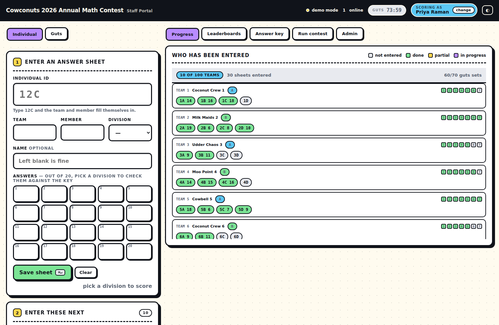
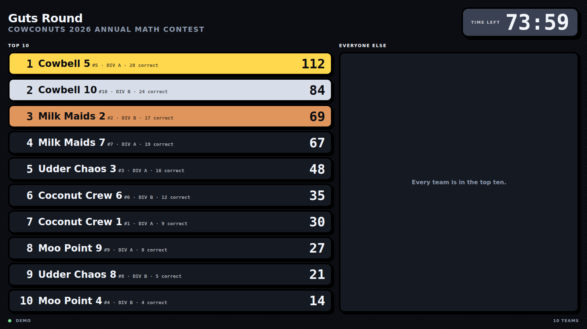

# Cowconuts 2026 Annual Math Contest — Staff Portal

Answer entry and live scoring for a two-round contest: a 20-problem individual
round and a 7-set guts round, both auto-graded against an answer key you keep in
the portal. Plus a public guts leaderboard for the projector.

No accounts, no per-scorer logins, no monthly bill.



---

## What it does

**The two divisions sit different papers.** Division A and Division B each have their
own 20-problem individual key, edited on their own tab. Guts is one paper for
everybody. A sheet is always marked against the division you picked for it, and
switching the dropdown re-marks it — so a sheet keyed against the wrong paper shows
up as a wall of red rather than a plausible score.

**Type a sheet, not a score.** Enter `12C` and the team and member boxes fill
themselves in — both stay editable. Pick a division, optionally a name, then key the
20 answers. Boxes turn green or red against the answer key as you type, so a
mis-keyed digit is visible before you save.

**The answer boxes behave like a keypad.** Enter moves on, arrows move around,
backspace on an empty box steps back, and pasting a row of numbers spreads it across
the grid. Non-negative integers only; anything else is refused at the box.

**Guts, a set at a time.** Pick a team and a set, key its four answers. Point values
rise by set and are edited in the same place as the key. The first time a team is
scored you give it a name — that is what the public board shows.

**Progress is person by person.** The right-hand panel lists teams with a chip per
contestant and their score, plus seven pips for that team's guts sets. Twenty boxes
per contestant would be unreadable at contest scale; one chip is not.

**Nobody enters the same sheet twice.** Opening a sheet or a set takes a real lock —
an atomic insert, taken over only by you or after two minutes of silence. Anyone else
who lands there is told who has it, and it drops out of their queue.

**Three leaderboards**, split by division: individual, guts, and a combined score.

**A public guts board on its own URL** (`guts.html`) — top ten large on the left,
everyone else scrolling on the right, a live clock, and nothing whatsoever from the
staff portal.



**A clock you can actually run.** Start, pause, ±1 minute, reset, and an editable
length — all mid-contest, all reflected on the public board within a second. The
board freezes itself with 10 minutes left (configurable) so the finish is a reveal;
unfreezing publishes everything that happened during the freeze.

**Clear answer key** empties both divisions and guts in two deliberate clicks, keeping
the guts point values, which are configuration rather than answers.

**Disqualification** keeps every answer and simply stops a team ranking, and
**Clear test data** wipes a dry run while keeping your key and settings.

---

## The combined score

Individual and guts are on different scales — a full team can bank 80 individual
points against 112 from guts — so the weights apply to each round's **share of its
own maximum**, never to raw points:

```
individualPct = team individual total / (4 members × that division's paper)
gutsPct       = team guts total       / (sum of every guts problem's points)
combined      = 100 × (80 × individualPct + 20 × gutsPct) / 100
```

Weighting the raw numbers instead would have quietly given guts a much larger share
than the 20 you asked for. Hover any combined score to see both halves; the export
carries the percentages and both maxima so a result can be rechecked by hand.

---

## Setup

### 1. A Supabase project

Free tier. **SQL Editor → New query →** paste all of
[`supabase/schema.sql`](supabase/schema.sql) → **Run**. Safe to re-run.

> Already ran an earlier version? Re-run the file. It migrates the answer key to the
> per-division layout in place: whatever you had typed becomes Division A, and
> Division B starts as a copy of it rather than empty.
>
> Reusing the old SFPO project? Run the DROP block at the bottom of that file first —
> the proof-grading tables are gone. A fresh project is cleaner.

### 2. One shared staff account

**Authentication → Users → Add user.** Email `staff@sfpo.local`, a password you share
with your scorers, and tick **Auto Confirm User**.

### 3. Credentials

Either put them in [`assets/config.js`](assets/config.js), or — with nothing to
redeploy — paste them into **Connection settings** on the sign-in screen. Those are
stored in the browser and win over the file, which is the quick path when you rotate
a key mid-contest. `guts.html` also accepts `?url=…&key=…` so a projector machine can
be pointed at a project without touching storage.

### 4. Publish

**Settings → Pages → Deploy from a branch.** The portal is `/`, the public board is
`/guts.html`.

---

## When a deploy looks half-broken

GitHub Pages caches each file separately, so a browser can end up holding a new
`index.html` with a stale script. `APP_VERSION` in `config.js` and `data-app-version`
in the two HTML files are compared at boot; a mismatch shows a banner saying to hard
refresh, rather than leaving a panel with its controls quietly missing. Bump both
together on any deploy that changes markup and script at once.

## Security

The anon key is a public identifier and is meant to ship in client code. Every staff
table denies the anonymous role outright — reading one answer requires the shared
staff sign-in.

Two tables are readable without logging in, because the public board has no login:
`guts_public` (team, name, division, score, solved) and `contest_state` (the clock).
Neither holds an answer or any part of the key, so the board can be on a screen in
the room during the round without leaking anything a team could use.

---

## Running on the free tier

Two decisions keep this inside Supabase's free limits with a hall full of people:

**The portal patches, it does not refetch.** Realtime events are folded into the
cached snapshot row by row, with a full reload only on reconnect and every five
minutes as a safety net. Refetching every table on every change is the obvious
implementation and it does not survive contact with a real contest — twenty staff
machines each pulling a couple of hundred kilobytes per keystroke-sized change runs
to gigabytes of egress in an afternoon.

**The public board only writes rows that changed.** `refresh_guts_public()` upserts
with an `IS DISTINCT FROM` guard, so one guts entry moves one row instead of
rewriting all hundred and emitting a realtime message per team per save.

The public board prefers realtime and falls back to polling only if the socket fails
— for a room of viewers realtime is much the cheaper of the two. Supabase's free tier
allows 200 concurrent realtime connections; that is plenty for a projector and the
scoring team, but it is not a link to post to every competitor at once.

---

## Locally

```bash
npm run serve          # http://localhost:8000
```

With no credentials the portal runs in **demo mode** — fully working, stored in this
browser, and a second tab acts as a second scorer. **Admin → Load demo data** fills a
plausible half-scored contest. Once credentials *are* configured, `?demo=1` gives the
same sandbox on the live URL, useful for training a scorer without touching real
data. The bar reads **demo mode** in amber throughout.

## Tests

```bash
npm test               # 42 unit tests: scoring, the clock, realtime patching, lock contention
npm run test:e2e       # 77 browser checks, including ten scorers at once
```

Ten scorers at once is covered from both ends: the lock's mutual exclusion is unit
tested against the Postgres contract (ten racing claims on one sheet, exactly one
wins; an abandoned claim can be taken over, a live one cannot), and the browser
suite runs ten real tabs with ten identities entering and saving simultaneously.

The unit tests cover where a mistake would silently produce a wrong winner: blank
versus wrong versus unkeyed answers, zero as a real answer, rising guts points, the
weighting, disqualification, the clock in both its stored forms, the freeze
threshold, and the realtime cache patching. The browser suite drives the whole
entry flow, the public board, and the locking, and asserts it never contacts a live
Supabase project.

## Layout

```
index.html              the staff portal
guts.html               the public leaderboard — no login, no portal data
assets/
  config.js             credentials, round shape, weights
  app.js                entry console, progress, leaderboards, clock
  store.js              Supabase + demo backends, realtime patching
  scoring.js            pure logic — grading, standings, the clock
  csv.js                exports
  styles.css            design system
supabase/schema.sql     paste into the Supabase SQL editor
tests/                  unit tests + a two-tab browser test
```

---

The SFPO 2026 proof-grading portal this grew out of is preserved at commit
`ea105c7`, if it is ever wanted again.
