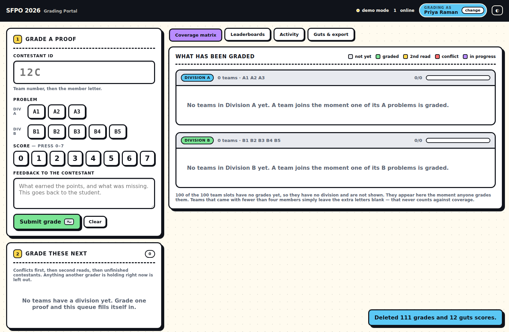

# SFPO 2026 — Staff Grading Portal

A grading console for the San Francisco Proof Open. A grader types a contestant ID,
picks a problem, taps a score, writes feedback, and moves on. Everything else —
who is grading what, what is left, and who is winning — updates on every screen at
once.

No accounts, no per-grader logins, no monthly bill.



---

## What it does

**Grading, in four keystrokes.** Type `12C`, click `A2`, press `6`, type feedback,
`⌘↵`. The portal then keeps the contestant loaded and jumps to their next ungraded
problem, so you work down a person rather than hunting for the next box.

**Your name is set once and stays put.** You enter it at the door; it sits in the top
bar and is stamped on every grade. Entering scores never disturbs it.

**No two people grade the same proof.** Opening a cell takes a lock on it. Anyone
else who lands there sees *"Dan Whitfield is grading this right now"*, and the cell
is dropped from their suggestion queue. The lock is a real one: a claim is taken by
an atomic insert, and the only claims that can be taken over are your own and those
nobody has refreshed in two minutes (someone who closed their laptop).

**It tells you what to grade next.** The queue is ordered by what actually matters:

1. **Conflicts** — two reads that disagree by 2 or more; someone has to settle it.
2. **Second reads** — a proof scored 5 or higher that only one person has seen.
3. **Finish this contestant** — they already have a read; close out the rest.
4. Everything else, lowest team number first.

You are never offered a second read of your own work, and never a cell someone else
is holding.

**A green matrix of both divisions.** Every contestant × every problem, split by
division, live. Grey is untouched, green is graded, amber wants a second read, red
is a conflict, purple is someone grading it this second. Click any cell to open it.

**Three leaderboards, computed as you go.** Individual (per contestant), Guts
(imported), and Combined, each split into Division A and Division B. Rows say plainly
why they are not final yet — `grading`, `awaiting guts`, `guts only` — so a
half-graded team is never mistaken for a winner.

**Combined is a weighted blend, done properly.** Default 80% proof / 20% guts,
editable from the app. The weights apply to each side's *share of its own maximum*,
not to raw points:

```
proofPct = team proof / (4 members × problems × 7)      # 84 in Div A, 140 in Div B
gutsPct  = team guts  / gutsMax                          # highest imported, or set by hand
combined = 100 × (80 × proofPct + 20 × gutsPct) / 100
```

That distinction is not pedantry. Weighting the raw points instead would have given
guts roughly 26% of the result in Division A and 18% in Division B for the same
nominal "20%" — a different contest in each division. Normalising first makes 80/20
mean 80/20 everywhere. Hover any combined score to see both halves; the export
carries the percentages and maxima so the result is checkable by hand.

**Disqualification.** Guts & export → Disqualifications takes a team number and a
reason. A DQ'd team keeps every grade it has: it stops ranking, drops out of the
grading queue and the coverage count, is marked in the matrix, and is listed
separately under each leaderboard with its reason. Reinstating restores the exact
score — nothing is ever deleted.

**Guts round by CSV.** Drop in a `team,score` file. An optional third `division`
column assigns divisions at the same time.

**Export when you are done.** All grades with feedback, individual results, or the
final combined standings — as CSV.

**It stays quick at full scale.** With 100 teams the matrix is about 1,600 cells and
a grade lands on every grader's screen several times a minute. The grid is built once
per shape change and only repainted after that, which keeps a realtime update at
around 40ms instead of the ~156ms a full rebuild costs.

---

## The stack, and why

| | | |
|---|---|---|
| **Database** | [Supabase](https://supabase.com) free tier | Postgres with **real** websocket realtime, an auto-generated REST API, and built-in auth. Nothing to write or host. |
| **Hosting** | GitHub Pages | Static files, free, already where the code lives. |
| **Build step** | none | Plain ES modules. What you edit is what ships. |

Total cost: **$0**. The only free-tier catch worth knowing: a Supabase project pauses
after about a week with no traffic. One click in the dashboard wakes it. Open the
portal the day before the contest and it will be awake on the day.

Firebase would also work, but the leaderboard maths would have to live in the browser
and concurrent writes get awkward. Cloudflare D1 never sleeps but has no realtime, so
the "nobody grades the same proof twice" guarantee degrades to polling. Supabase is
the one that gives all three of realtime, SQL, and free.

---

## Setup (about 15 minutes)

### 1. Create the database

1. Make a free project at [supabase.com](https://supabase.com).
2. Open **SQL Editor**, paste all of [`supabase/schema.sql`](supabase/schema.sql), and
   hit **Run**. It creates the tables, locks them down, and turns on realtime. It is
   safe to run again later.

### 2. Create the one shared staff account

Nobody gets a personal login. There is a single account the whole grading team shares.

1. **Authentication → Users → Add user**.
2. Email: `staff@sfpo.local` (any address; it is never emailed).
3. Password: pick something and share it with your graders.
4. Tick **Auto Confirm User**.

### 3. Point the portal at it

In **Settings → API**, copy the Project URL and the `anon` public key into
[`assets/config.js`](assets/config.js):

```js
SUPABASE_URL: 'https://xxxxxxxxxxxx.supabase.co',
SUPABASE_ANON_KEY: 'eyJhbGciOi...',
STAFF_EMAIL: 'staff@sfpo.local',
```

Both are safe to commit — see [Security](#security).

### 4. Publish

**Settings → Pages → Build and deployment → Deploy from a branch**, pick your branch
and `/ (root)`. A minute later the portal is live at
`https://<you>.github.io/sfpoproofs/`.

Send graders that link and the staff password. That is the whole onboarding.

---

## Security

The `anon` key in `config.js` is a public identifier — it is meant to ship in
client code. It grants nothing on its own, because **every table denies the
anonymous role entirely**:

```sql
create policy staff_all on grades for all to authenticated using (true) with check (true);
```

Reading or writing a single score requires a signed-in session, and the only way to
get one is the shared staff password — which a grader types at the door and which is
never in this repository. Someone who finds the URL and reads the source sees a page
that will not show them one contestant's score.

What this deliberately does *not* do: distinguish one grader from another. Anyone
with the staff password can edit any grade, and the grader name is self-reported.
That is the right trade for a one-day contest with a known team in a Discord, and it
is why every grade records who entered it. If you need more, give each grader a real
Supabase user and change the policies to key off `auth.uid()`.

Rotate the password after the contest (**Authentication → Users**), and the portal
is inert.

---

## Running it locally

```bash
npm run serve          # http://localhost:8000
```

With `SUPABASE_URL` blank the portal boots into **demo mode**: fully functional,
data kept in `localStorage`, and a second browser tab acts as a second grader so you
can try the live locking without a database. **Guts & export → Load demo data** fills
in a believable half-graded contest to click around in.

Once credentials *are* configured, add `?demo=1` to the URL to get the same sandbox
without touching the real database — useful for training a grader on the live site.
The top bar reads **demo mode** in amber throughout, so it can't be mistaken for the
real thing. The browser tests pin themselves to `?demo=1` for exactly this reason.

## Tests

```bash
npm test                 # 39 unit tests over the scoring + CSV logic
npm run test:e2e         # 70 browser checks, driving two tabs as two graders
                         # (set CHROMIUM_PATH to reuse a preinstalled browser)
```

The unit tests cover the parts where a mistake would silently produce a wrong
winner: score resolution across two reads, second-read and conflict thresholds,
team and combined totals, division inference, queue ordering, and the CSV parser.
The browser test drives two tabs as two different graders to prove the locking.

---

## Contest-day notes

- **IDs are `<team><letter>`** — `12C` is team 12, member C. `12c` and `012C` both
  work. Division comes from the problem you pick, so `A2` puts team 12 in Division A
  and nobody has to declare it. If a team is already in one division and you pick the
  other division's problem, the portal stops you with a red warning — that is almost
  always a mistyped ID.
- **Teams with 1–3 members are normal.** The matrix draws four member slots per team
  because it has no roster; slots nobody ever grades stay faded and are excluded from
  the coverage count, so a two-person team never shows as 50% done.
- **Set the team count** in *Guts & export*. It defaults to 100. A contestant graded
  outside the range still appears anyway, marked with a ⚠, so a late registration is
  never silently dropped. Note that once a database has saved its settings, the stored
  value wins over `config.js` — change it in the UI, not the file, so every grader
  picks it up.
- **Clear the dry run before the contest.** *Guts & export → Clear test data* deletes
  every grade, guts score, team and lock, but keeps your settings. It needs the word
  `ERASE` typed in to arm, and there is no undo — export first if you want the data.
- **Tune the thresholds mid-contest.** Second-read and conflict thresholds are saved
  to the database, so changing them updates every grader's screen.
- **The keyboard is faster.** `0`–`7` set the score from anywhere outside a text box;
  `⌘↵` / `Ctrl+↵` submits; `Enter` in the ID box jumps to that contestant's first
  ungraded problem.

## Layout

```
index.html              the portal
assets/
  config.js             ← the only file you need to edit
  app.js                UI and wiring
  store.js              data layer: Supabase backend + localStorage demo backend
  scoring.js            pure logic — totals, thresholds, queue ordering
  csv.js                guts import, result exports
  styles.css            the design system
supabase/schema.sql     paste into the Supabase SQL editor
tests/                  unit tests + a two-tab browser test
```
